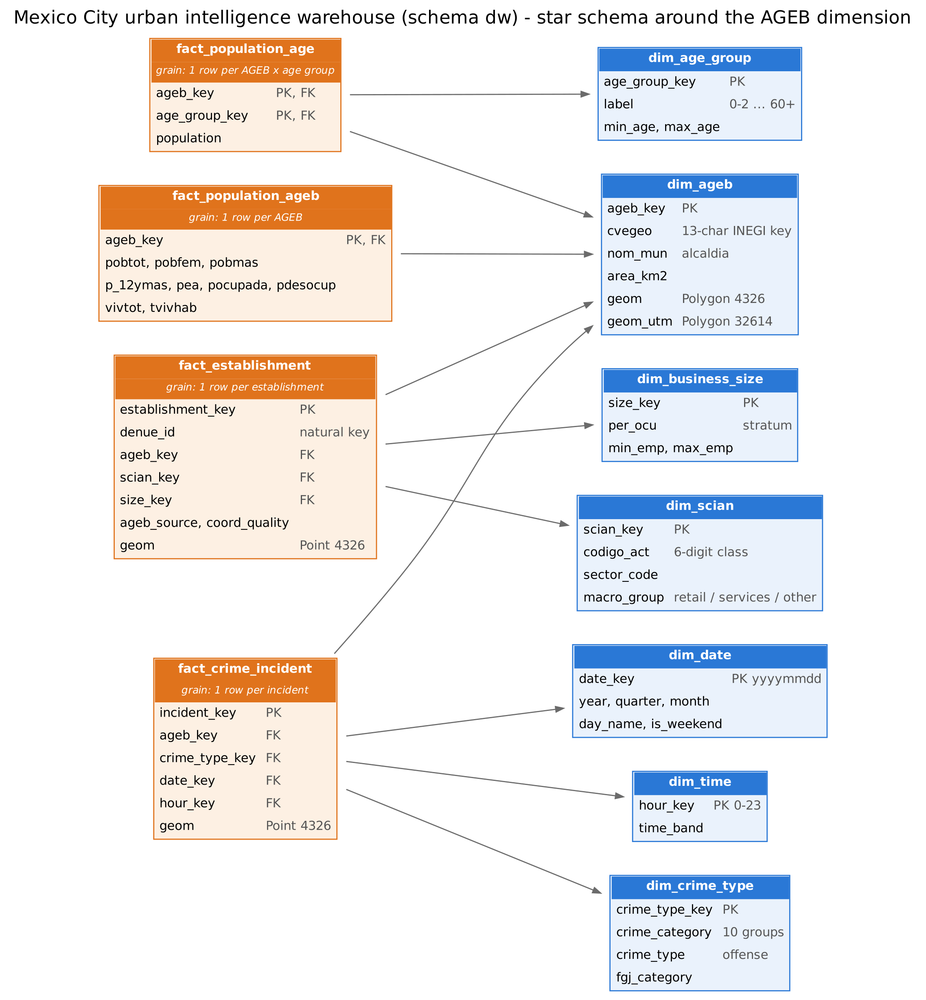

# Mexico City Urban Intelligence: Geospatial Data Warehouse

Business Intelligence, Unit 2 project (E2 Datawarehouse Design), Universidad Politecnica de Yucatan.
Study area: the 16 alcaldias of Mexico City (CDMX). Unit of analysis: the INEGI urban AGEB.

## 1. Overview and objective

The project builds a reproducible pipeline that integrates **demographic**, **economic** and **public-safety** data
into a PostgreSQL/PostGIS dimensional warehouse and uses it to answer: *how do population, business activity and
crime relate across Mexico City, and are those patterns spatially clustered?*

The pipeline has three phases, each with its own deliverable:

| Phase | What it does | Where |
|---|---|---|
| 1. Data and geographic assessment | Profiles every source, compares candidate geographic units, tests point-to-polygon integration | `notebooks/01_data_geographic_assessment.ipynb` |
| 2. ETL and warehouse | Cleans the sources, loads staging tables and builds the star schema and KPI views in PostGIS | `src/`, `sql/`, `notebooks/02_kpi_calculation_and_maps.ipynb` |
| 3. Spatial analytics | Maps, correlations, global Moran's I, LISA clusters and bivariate Moran | `notebooks/03_spatial_analysis.ipynb`, `src/spatial_analysis.py` |

## 2. Data sources

| Source | Content | Native grain | Year / edition | Key variables |
|---|---|---|---|---|
| INEGI Census of Population and Housing 2020, "Principales resultados por AGEB y manzana urbana" | Population and economic indicators | AGEB (we keep the AGEB totals, 2,433 rows) | 2020 (only edition available) | `POBTOT`, `POBFEM`, `POBMAS`, age groups `P_0A2`...`P_60YMAS`, `P_12YMAS`, `PEA`, `POCUPADA`, `PDESOCUP`, `VIVTOT` |
| INEGI DENUE | Economic establishments | Point (458,228 establishments) | Edition 11/2024 | `id`, `codigo_act` (SCIAN), `per_ocu`, `latitud`, `longitud`, AGEB code |
| FGJ CDMX, investigation files (datos.cdmx.gob.mx) | Reported crimes | Point (2,098,743 rows in the file, 216,965 with incident date in 2024) | Incident year 2024 (`fecha_hecho`) | `delito`, `categoria_delito`, `fecha_hecho`, `hora_hecho`, `latitud`, `longitud` |
| INEGI Marco Geoestadistico 2020 | Urban AGEB polygons and state boundary | Polygon (2,431 AGEB in CDMX) | 2020 | `CVEGEO`, geometry |

The sources do not share a year: population is from 2020 (the Census is decennial), businesses from 11/2024 and crime
from 2024. This is a documented limitation (section 11).

**[Data files (SharePoint)](https://upy-my.sharepoint.com/:f:/g/personal/2309067_upy_edu_mx/IgA2VhPAVRNoQ5qMEUovVe1JAV3jtIvUBZ7Ttch_5v4GSTk?e=jAhWej)**; they can also be downloaded from the official pages below. Put them in
`data/raw/downloads/` without renaming them (section 10).

Official download pages: Census 2020 results by AGEB (INEGI SCITEL) at https://www.inegi.org.mx/app/scitel/Default?ev=10 ,
DENUE (INEGI bulk download) at https://www.inegi.org.mx/app/descarga/default.html , Marco Geoestadistico at
https://www.inegi.org.mx/temas/mg/ , and the FGJ crime file (resource "Carpetas de Investigacion, acumulado 2016-2024", CSV
`carpetasFGJ_acumulado_2025_01.csv`) at
https://datos.cdmx.gob.mx/dataset/carpetas-de-investigacion-fgj-de-la-ciudad-de-mexico/resource/35e87ce4-8e40-4de4-8dac-0b59645c13eb .

## 3. Geographic strategy

Candidate units were compared in notebook 01:

| Unit | Polygons | Verdict |
|---|---|---|
| Alcaldia | 16 | Too coarse for spatial statistics |
| **Urban AGEB** | **2,431** | **Selected**: official polygons, complete Census indicators, 13-character key shared with the Census, enough events per unit |
| Block (manzana) | 66,456 | Too fine: most blocks have no crime and many Census values are suppressed |
| Colonia | n/a | No official polygons in the sources |

Integration rules:

* **Census to polygons:** join on the 13-character key `CVEGEO` = state (2) + alcaldia (3) + locality (4) + AGEB (4).
* **Points to polygons:** a PostGIS spatial join (`ST_Intersects`) assigns each crime and each establishment to one AGEB.
  For DENUE, the AGEB code in the file is only a fallback when the coordinates are unusable.
* **CRS:** everything is stored in EPSG:4326; areas and densities use EPSG:32614 (UTM zone 14N, metres).
* **Result:** 99.75% of crime points inside CDMX and 99.67% of establishments land in an AGEB by location, none matches two
  polygons, and the DENUE AGEB code agrees with the spatial join for 99.78% of establishments. The rest lie in rural land
  outside the urban AGEB layer.

## 4. ETL decisions

| Step | Script | Decisions |
|---|---|---|
| Census | `src/01_clean_census.py` | Keep AGEB totals (`MZA = 000`, `AGEB != 0000`); `*` and `N/D` become NULL, never zero; derive the 25-59 age group as total minus the other groups (NULL if any part is suppressed) |
| DENUE | `src/02_clean_denue.py` | Read as latin-1; deduplicate by `id`; flag 35 establishments with coordinates outside CDMX as `invalid` (kept) |
| Geography | `src/03_prepare_geography.py` | Reproject from INEGI's Lambert conformal conic to EPSG:4326; validate geometries; report Census AGEB without polygon (2, excluded) |
| Crime | `src/04_clean_crime.py` | Filter by **incident date** 2024 (the filing year differs); drop 6,504 non-criminal events; parse mixed date and `HH:MM:SS:SS` time formats; build 10 analytical crime groups (`src/crime_taxonomy.py`); 12,403 files without coordinates and 51 outside CDMX stay in staging but are not loaded to the fact table |
| Staging | `src/05_load_staging.py` | Write cleaned tables to schema `stg` |
| Warehouse | `src/06_build_warehouse.py` | Run `sql/01_schema.sql` to `05_comments.sql`, then the validation checks in `sql/04_validation.sql`; exits with an error if any check fails |

`sql/02_load.sql` is idempotent (truncate and reload), so the pipeline can be re-run safely.

## 5. PostGIS setup

Option A, local PostgreSQL with PostGIS installed:

```bash
createdb cdmx_dw
psql -d cdmx_dw -c "CREATE EXTENSION postgis;"
```

Option B, Docker (no local installation needed; on Windows, open Docker Desktop first and wait until it is running):

```bash
docker compose up -d
```

The container is called `cdmx_dw`, uses the PostGIS 16 image and creates the database `cdmx_dw` by itself.

Copy `.env.example` to `.env` and adjust the connection values if yours differ. If another PostgreSQL already uses port
5432 on your computer (common on Windows), the pipeline can fail with `database "cdmx_dw" does not exist` because the other
server answers. In that case set `PGPORT=5433` in `.env` and run `docker compose up -d` again: the compose file reads
the same variable.

## 6. Data warehouse model



Star schema in schema `dw`, centred on the AGEB dimension. The full column list is in
[`docs/data_dictionary.md`](docs/data_dictionary.md), generated from the database catalogue.

| Table | Type | Grain | Relationships |
|---|---|---|---|
| `fact_population_ageb` | Fact | One row per AGEB | `dim_ageb` |
| `fact_population_age` | Fact | One row per AGEB and age group | `dim_ageb`, `dim_age_group` |
| `fact_establishment` | Fact | One row per DENUE establishment | `dim_ageb`, `dim_scian`, `dim_business_size` |
| `fact_crime_incident` | Fact | One row per reported crime | `dim_ageb`, `dim_crime_type`, `dim_date`, `dim_time` |
| `dim_ageb`, `dim_date`, `dim_time`, `dim_crime_type`, `dim_scian`, `dim_business_size`, `dim_age_group` | Dimensions | | |
| `etl_source_log` | Traceability | One row per source loaded | |

Design choices: surrogate keys with the natural key (`cvegeo`, `denue_id`) kept for traceability; spatial indexes (GiST)
on every geometry; both a display geometry (EPSG:4326) and a metric geometry (EPSG:32614) on `dim_ageb`; the
population, business and crime facts stay at their native grain and are aggregated by views.

## 7. KPI definitions

All 14 required KPIs are computed in SQL from the warehouse (`sql/03_views.sql`, main view `dw.vw_ageb_kpis`).

| # | KPI | Formula | Column / view |
|---|---|---|---|
| 1 | Total population | `POBTOT` | `total_population` |
| 2 | Population density | `POBTOT / area_km2` | `population_density_km2` |
| 3 | Economically active population rate | `100 * PEA / P_12YMAS` | `eap_rate_pct` |
| 4 | Population by age group | Residents in each of 8 groups | `pop_0_2` ... `pop_60_plus` |
| 5 | Total businesses | Count of establishments in the AGEB | `total_businesses` |
| 6 | Business density | `businesses / area_km2` | `business_density_km2` |
| 7 | Businesses per 1,000 residents | `1000 * businesses / POBTOT` | `businesses_per_1000` |
| 8 | Retail density | Retail establishments (SCIAN sector 46) per km2 | `retail_density_km2` |
| 9 | Service density | Service establishments (SCIAN 51-56, 61, 62, 71, 72, 81) per km2 | `service_density_km2` |
| 10 | Dominant economic activity | SCIAN sector with most establishments (ties: lowest code) | `dominant_sector_name` |
| 11 | Total crime incidents | Incidents with incident date in 2024 | `total_crimes` |
| 12 | Crime rate | `1000 * incidents / POBTOT` | `crime_rate_per_1000` |
| 13 | Incidents by type and time | Incidents by crime group, year, month, weekday and time band | `dw.vw_crime_type_time` |
| 14 | Crime relative to business activity | `100 * incidents / businesses` | `crimes_per_100_businesses` |

Rates are only analysed for AGEB with at least 500 residents (`MIN_POP_FOR_RATES` in `src/spatial_analysis.py`), because
rates in very small populations are unstable.

## 8. Main results

Citywide, the warehouse holds 9,138,524 residents, 456,763 establishments and 197,518 located crime incidents across
2,431 AGEB. Spatial statistics (999 permutations, Queen contiguity; KNN-8 as sensitivity check):

| Result | Value |
|---|---|
| Global Moran's I, economically active rate | 0.53 |
| Global Moran's I, population density (log) | 0.49 |
| Global Moran's I, crime rate (log) | 0.49 |
| Global Moran's I, business density (log) | 0.43 |
| Bivariate Moran's I, business density vs neighbours' crime rate | 0.19 |
| LISA crime hot spots (High-High) / cold spots (Low-Low) | 248 / 191 AGEB |
| Spearman, crime rate vs business density | 0.28 |
| Spearman, crime rate vs share aged 60+ | 0.40 |

All Moran statistics are significant (pseudo p = 0.001). Crime and businesses cluster in space, and areas with many
businesses tend to be surrounded by neighbours with higher crime rates. The correlations are associations between area
aggregates, not evidence of cause. Maps are in `outputs/maps/`, figures in `outputs/figures/` and tables in
`outputs/tables/`; the interpretation is written next to each result in notebook 03.

## 9. Repository structure

```
.
|-- README.md
|-- requirements.txt
|-- docker-compose.yml          optional PostGIS container
|-- .env.example                database connection template
|-- pytest.ini                  test configuration
|-- data/
|   |-- raw/                    original downloads (not versioned)
|   `-- processed/              cleaned parquet / gpkg files (not versioned)
|-- notebooks/
|   |-- 01_data_geographic_assessment.ipynb
|   |-- 02_kpi_calculation_and_maps.ipynb
|   `-- 03_spatial_analysis.ipynb
|-- src/
|   |-- config.py               paths and settings
|   |-- db.py                   database connection
|   |-- crime_taxonomy.py       crime groups and time parsing
|   |-- 00_unpack_raw.py ... 06_build_warehouse.py   ETL steps
|   |-- run_all.py              runs steps 01-06
|   |-- spatial_analysis.py     weights, correlations, Moran, LISA
|   `-- viz.py                  map and chart helpers
|-- sql/
|   |-- 01_schema.sql           schemas, dimensions, facts, indexes
|   |-- 02_load.sql             load and spatial join (idempotent)
|   |-- 03_views.sql            KPI views
|   |-- 04_validation.sql       integrity checks
|   `-- 05_comments.sql         table and column comments
|-- tests/                      pytest unit tests
|-- tools/
|   |-- generate_data_dictionary.py
|   `-- make_model_diagram.py
|-- docs/
|   |-- technical_report.pdf
|   |-- data_dictionary.md
|   |-- warehouse_model.png
|   |-- warehouse_model_wide.png
|   |-- presentation.pptx
|   `-- qa/                     data-quality reports written by the ETL
`-- outputs/
    |-- maps/
    |-- figures/
    `-- tables/
```

## 10. Reproducibility

Requirements: Python 3.10 or newer, Docker Desktop (or a local PostgreSQL 14+ with PostGIS 3) and, only for the model
diagram, Graphviz. The pipeline was run end to end on Windows (Python 3.10, PostGIS 16-3.4 in Docker) and on Linux
(Python 3.13) with identical results.

Windows, Command Prompt (CMD), from the project folder:

```bat
python -m venv .venv
.venv\Scripts\activate
python -m pip install --upgrade pip
pip install -r requirements.txt
set PYTHONUTF8=1
copy .env.example .env
docker compose up -d
```

Put the five zip files in `data\raw\downloads\`, then:

```bat
python src\00_unpack_raw.py
python src\run_all.py
cd notebooks
jupyter nbconvert --to notebook --execute --inplace 01_data_geographic_assessment.ipynb
jupyter nbconvert --to notebook --execute --inplace 02_kpi_calculation_and_maps.ipynb
jupyter nbconvert --to notebook --execute --inplace 03_spatial_analysis.ipynb
cd ..
python -m pytest
```

In PowerShell, activate the environment with `.venv\Scripts\Activate.ps1` (if scripts are blocked, run
`Set-ExecutionPolicy -Scope Process -ExecutionPolicy Bypass` first) and use `$env:PYTHONUTF8 = "1"`.

macOS / Linux:

```bash
python3 -m venv .venv && source .venv/bin/activate
pip install -r requirements.txt
cp .env.example .env
docker compose up -d
python src/00_unpack_raw.py
python src/run_all.py
cd notebooks
for n in 01_data_geographic_assessment 02_kpi_calculation_and_maps 03_spatial_analysis; do
  jupyter nbconvert --to notebook --execute --inplace $n.ipynb
done
cd .. && python -m pytest
```

Optional, to regenerate the documentation files (the diagram needs the Graphviz program installed):

```bash
python tools/generate_data_dictionary.py
python tools/make_model_diagram.py
```

What to expect: `run_all.py` runs steps 01 to 06 (several minutes, most of it loading the staging tables) and stops with an
error if any of the 11 validation checks fails. Notebook 03 takes a few minutes because of the permutation tests.

Expected raw layout (created by `00_unpack_raw.py`):

```
data/raw/census/RESAGEBURB_09CSV20.csv
data/raw/mg2020/ageb_urbano/2020_1_09_A.shp
data/raw/mg2020/agee/2020_1_09_ENT.shp
data/raw/denue/ed1124/conjunto_de_datos/denue_inegi_09_.csv
data/raw/crime/carpetasFGJ_acumulado_2025_01.csv
```

Step 5 of the pipeline (`05_load_staging.py`) takes a few minutes because it writes about 670,000 rows.
`06_build_warehouse.py` stops with an error if any validation check fails, so a successful `run_all.py` means the
warehouse reconciles with the staged data.

## 11. Assumptions, data quality and limitations

* **Different years.** Population is 2020, businesses 11/2024 and crime 2024. Density and rate KPIs mix these years, and
  population change since 2020 is not captured.
* **Crime data are reports, not all crimes.** Files opened by the authorities depend on the willingness to report, which
  varies by area. About 6% of 2024 criminal files have no coordinates and are not mapped.
* **Time of day is heaped.** 44% of crime times fall exactly on a round hour and 8% at 12:00:00, so results use time bands,
  not single hours.
* **Residential population is the denominator.** Crime rates are inflated in AGEB with many workers and visitors but few
  residents (the city centre), so the "crime relative to business activity" KPI is reported next to the per-resident rate.
* **Modifiable areal unit problem.** AGEB differ in size and shape; results were checked with two neighbour definitions
  (Queen and 8 nearest neighbours) and with an Empirical Bayes rate (notebook 03).
* **Excluded areas.** Two Census AGEB (7,108 residents, under 0.1% of the population) have no polygon. Rural land outside the
  urban AGEB layer is not covered.
* **Suppressed Census values** are kept as NULL and excluded from the statistics that need them.
* **Association only.** Correlations and Moran statistics describe patterns, not causes.

## 12. Team and contributions

| Member | GitHub | Main contribution |
|---|---|---|
| Diego De Gante Perez | `ddgant` | Repository scaffold, configuration, pipeline runner, README, integration |
| Rodrigo | `dodi488` | ETL cleaning scripts (Census, DENUE, geography, crime), crime taxonomy, tests |
| Arturo | `Arturo-Balam` | SQL schema, load, views and validation, staging and warehouse build, data dictionary and model diagram |
| Rous | `RousPolanco` | Phase 1 and KPI notebooks, technical report |
| Mauricio | `Mawit0` | Spatial analysis module, visualisation helpers, notebook 03, presentation |
